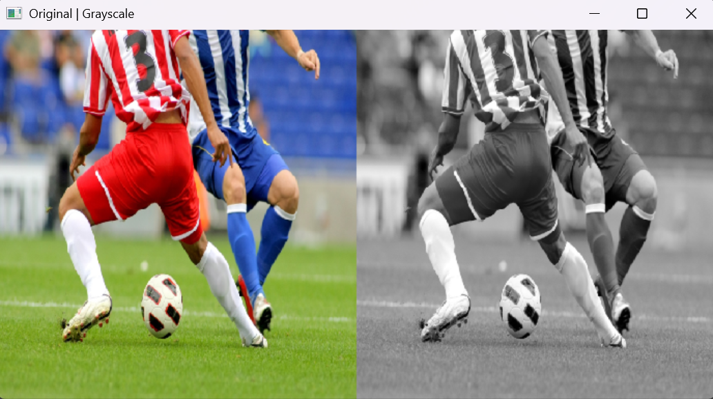
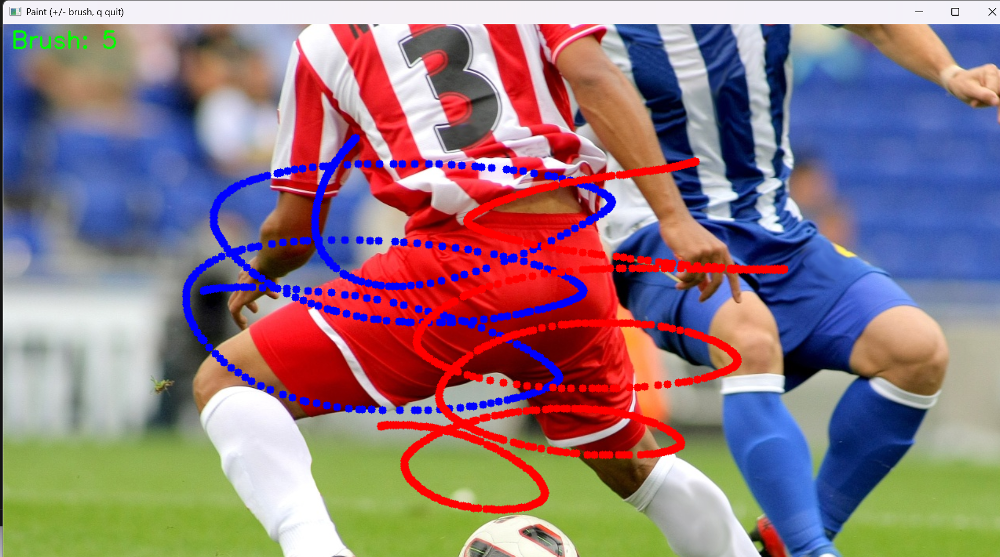
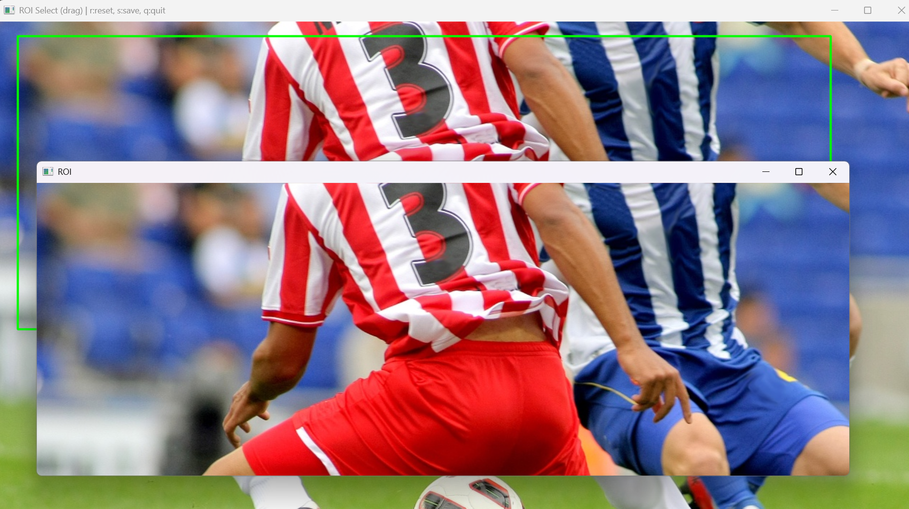

# E01. OpenCV 실습 과제

## 0. 과제 개요

이번 과제에서는 OpenCV를 사용하여 기본적인 이미지 처리 및 마우스 이벤트 처리를 구현합니다.

---

## 요구사항 및 설치

- Python 3.7 이상
- OpenCV (`opencv-python`)
- NumPy (`numpy`)

설치

```bash
pip install opencv-python numpy
```

---

## 폴더 구조 (요약)

```
E01_OpenCV/
│
├── cv01_grayscale.py
├── cv02_paint.py
├── cv03_roi.py
│
├── images/
│   └── soccer.jpg
│
└── outputs/
    ├── cv01_result.png
    ├── cv02_result.png
    └── cv03_result.png
```

- `cv01_grayscale.py` : 이미지 불러오기 + 그레이스케일 변환
- `cv02_paint.py` : 마우스 페인팅
- `cv03_roi.py` : ROI 선택 및 저장

---

# 실행 방법

```bash
python cv01_grayscale.py
python cv02_paint.py
python cv03_roi.py
```

또는

```bash
python E01_OpenCV/cv01_grayscale.py
python E01_OpenCV/cv02_paint.py
python E01_OpenCV/cv03_roi.py
```

---

# Problem 1 — Grayscale Conversion

이미지를 불러온 후 Grayscale로 변환하고  
원본 이미지와 나란히 출력합니다.

---

## 실행 결과

<figure>
  
  <figcaption>원본 이미지와 Grayscale 변환 결과</figcaption>
</figure>

---

<details>
<summary>전체 코드 — cv01_grayscale.py</summary>

```python
# cv01_grayscale.py
import os
import sys
import argparse
import cv2 as cv
import numpy as np

try:
    import tkinter as tk
except Exception:
    tk = None


def main():
    parser = argparse.ArgumentParser(description="원본 이미지와 그레이스케일 이미지를 나란히 표시합니다.")
    default_image = os.path.join(os.path.dirname(__file__), "images", "soccer.jpg")
    parser.add_argument("image", nargs="?", default=default_image, help=f"불러올 이미지 경로 (기본: {default_image})")
    args = parser.parse_args()

    img = cv.imread(args.image)
    if img is None:
        print(f"이미지를 불러올 수 없습니다: {args.image}")
        sys.exit(1)

    gray = cv.cvtColor(img, cv.COLOR_BGR2GRAY)
    gray_color = cv.cvtColor(gray, cv.COLOR_GRAY2BGR)
    result = np.hstack((img, gray_color))

    margin = 100
    if tk is not None:
        root = tk.Tk()
        root.withdraw()
        screen_w = root.winfo_screenwidth()
        screen_h = root.winfo_screenheight()
        root.destroy()
    else:
        screen_w, screen_h = 1280, 720

    res_h, res_w = result.shape[:2]
    scale = min(1.0, (screen_w - margin) / res_w, (screen_h - margin) / res_h)

    if scale < 1.0:
        new_w = int(res_w * scale)
        new_h = int(res_h * scale)
        result_show = cv.resize(result, (new_w, new_h), interpolation=cv.INTER_AREA)
    else:
        result_show = result

    cv.namedWindow("Original | Grayscale", cv.WINDOW_NORMAL)
    cv.imshow("Original | Grayscale", result_show)
    cv.waitKey(0)
    cv.destroyAllWindows()


if __name__ == "__main__":
    main()
```

</details>

---

# Problem 2 — Mouse Paint

마우스로 이미지 위에 그림을 그리는 프로그램입니다.

기능

- 좌클릭 : 파란색 그리기
- 우클릭 : 빨간색 그리기
- `+` : 붓 크기 증가
- `-` : 붓 크기 감소
- `q` : 종료

---

## 실행 결과

<figure>
  
  <figcaption>마우스로 직접 그린 그림 예시</figcaption>
</figure>

---

<details>
<summary>전체 코드 — cv02_paint.py</summary>

```python
# cv02_paint.py
import cv2 as cv
import numpy as np

drawing = False
brush_size = 5
brush_min = 1
brush_max = 15
color = (255, 0, 0)

img = None
win_name = "Paint (+/- brush, q quit)"


def clamp(v, lo, hi):
    return max(lo, min(hi, v))


def on_mouse(event, x, y, flags, param):
    global drawing, color, img, brush_size

    if event == cv.EVENT_LBUTTONDOWN:
        drawing = True
        color = (255, 0, 0)
        cv.circle(img, (x, y), brush_size, color, -1)

    elif event == cv.EVENT_RBUTTONDOWN:
        drawing = True
        color = (0, 0, 255)
        cv.circle(img, (x, y), brush_size, color, -1)

    elif event == cv.EVENT_MOUSEMOVE and drawing:
        cv.circle(img, (x, y), brush_size, color, -1)

    elif event in (cv.EVENT_LBUTTONUP, cv.EVENT_RBUTTONUP):
        drawing = False


def main():
    global img, brush_size

    src = cv.imread("images/soccer.jpg")

    if src is None:
        print("이미지를 불러올 수 없습니다.")
        return

    img = src.copy()

    cv.namedWindow(win_name)
    cv.setMouseCallback(win_name, on_mouse)

    while True:

        preview = img.copy()

        cv.putText(
            preview,
            f"Brush: {brush_size}",
            (10, 30),
            cv.FONT_HERSHEY_SIMPLEX,
            1.0,
            (0, 255, 0),
            2,
        )

        cv.imshow(win_name, preview)

        key = cv.waitKey(1) & 0xFF

        if key == ord("q"):
            break

        if key == ord("+"):
            brush_size = clamp(brush_size + 1, brush_min, brush_max)

        if key == ord("-"):
            brush_size = clamp(brush_size - 1, brush_min, brush_max)

    cv.destroyAllWindows()


if __name__ == "__main__":
    main()
```

</details>

---

# Problem 3 — ROI Selection

마우스 드래그를 이용하여 관심 영역(ROI)을 선택하고 저장하는 프로그램입니다.

기능

- 드래그 : ROI 선택
- `r` : 리셋
- `s` : ROI 저장
- `q` : 종료

---

## 실행 결과

<figure>
  
  <figcaption>마우스로 선택한 ROI 영역</figcaption>
</figure>

---

<details>
<summary>전체 코드 — cv03_roi.py</summary>

```python
# cv03_roi.py
import os
import time
import cv2 as cv
import numpy as np

start_pt = None
end_pt = None
dragging = False
roi_img = None
src = None
display = None

win_name = "ROI Select (drag) | r:reset, s:save, q:quit"


def normalize_rect(p1, p2):

    x1, y1 = p1
    x2, y2 = p2

    left = min(x1, x2)
    right = max(x1, x2)

    top = min(y1, y2)
    bottom = max(y1, y2)

    return left, top, right, bottom


def on_mouse(event, x, y, flags, param):

    global start_pt, end_pt, dragging, roi_img, display, src

    if event == cv.EVENT_LBUTTONDOWN:

        start_pt = (x, y)
        end_pt = (x, y)

        dragging = True
        roi_img = None

    elif event == cv.EVENT_MOUSEMOVE and dragging:

        end_pt = (x, y)

        display = src.copy()

        l, t, r, b = normalize_rect(start_pt, end_pt)

        cv.rectangle(display, (l, t), (r, b), (0, 255, 0), 2)

    elif event == cv.EVENT_LBUTTONUP and dragging:

        dragging = False

        end_pt = (x, y)

        l, t, r, b = normalize_rect(start_pt, end_pt)

        if (r - l) >= 2 and (b - t) >= 2:

            roi_img = src[t:b, l:r].copy()

            cv.imshow("ROI", roi_img)

        display = src.copy()

        cv.rectangle(display, (l, t), (r, b), (0, 255, 0), 2)


def main():

    global src, display, start_pt, end_pt, roi_img, dragging

    base_dir = os.path.dirname(__file__)

    img_path = os.path.join(base_dir, "images", "soccer.jpg")

    out_dir = os.path.join(base_dir, "outputs")

    os.makedirs(out_dir, exist_ok=True)

    src = cv.imread(img_path)

    if src is None:

        print("이미지 로드 실패")

        return

    display = src.copy()

    cv.namedWindow(win_name)

    cv.setMouseCallback(win_name, on_mouse)

    while True:

        cv.imshow(win_name, display)

        key = cv.waitKey(1) & 0xFF

        if key == ord("q"):
            break

        if key == ord("r"):

            start_pt = None
            end_pt = None

            dragging = False
            roi_img = None

            display = src.copy()

        if key == ord("s"):

            if roi_img is not None:

                ts = time.strftime("%Y%m%d_%H%M%S")

                save_path = os.path.join(out_dir, f"roi_{ts}.png")

                cv.imwrite(save_path, roi_img)

                print("saved:", save_path)

    cv.destroyAllWindows()


if __name__ == "__main__":
    main()
```

</details>

---
