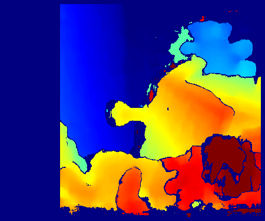
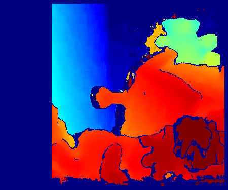
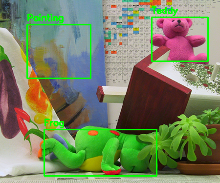

# E02. OpenCV 실습 과제

## 0. 과제 개요

이번 과제에서는 OpenCV를 사용하여 **카메라 보정(Camera Calibration)**,  
**기하학적 변환(Transform)**, **시차(Disparity) 및 깊이(Depth) 계산**을 구현합니다.

---

## 요구사항 및 설치

- Python 3.7 이상
- OpenCV (`opencv-python`)
- NumPy (`numpy`)

설치

```bash
pip install opencv-python numpy
```

---

## 폴더 구조 (요약)

```
E02_OpenCV/
│
├── images/
│   ├── rose.png
│   ├── left.png
│   ├── right.png
│   └── calibration_images/
│       ├── left01.jpg
│       ├── left02.jpg
│       └── ...
│
├── init_code/
│   ├── 01.Calibration.py
│   ├── 02.Transform.py
│   ├── 03.Depth.py
│   └── outputs/
│
├── outputs/
│   ├── 02_rose_original.png
│   ├── 02_rose_transformed.png
│   ├── 03_depth_color.png
│   ├── 03_disparity_color.png
│   ├── 03_left_roi.png
│   └── 03_right_roi.png
│
└── README.md
```

- `01.Calibration.py` : 체커보드 이미지를 이용한 카메라 보정
- `02.Transform.py` : 이미지 회전, 축소, 평행이동 변환
- `03.Depth.py` : Stereo Matching을 이용한 disparity 및 depth 계산
---

# 실행 방법

```bash
python init_code/01.Calibration.py
python init_code/02.Transform.py
python init_code/03.Depth.py
```

또는

```bash
python 01.Calibration.py
python 02.Transform.py
python 03.Depth.py
```

---

# Problem 1 — Camera Calibration

이미지를 불러온 후 Grayscale로 변환하고  
원본 이미지와 나란히 출력합니다.

---

## 실행 결과

카메라 보정이 완료되면 콘솔에 다음과 같이 내부 파라미터가 출력됩니다.

<figure>
  
  <figcaption>원본 이미지와 Grayscale 변환 결과</figcaption>
</figure>

---

<details>
<summary>전체 코드 — cv01_grayscale.py</summary>

```python
# cv01_grayscale.py
# OpenCV로 이미지를 불러와 그레이스케일 변환 후
# 원본 이미지와 나란히 출력하는 예제

import os                    # 파일 및 경로 처리를 위한 표준 라이브러리
import sys                   # 프로그램 종료 등 시스템 관련 기능을 위한 라이브러리
import argparse              # 명령줄 인자(argument)를 처리하기 위한 라이브러리
import cv2 as cv             # OpenCV 라이브러리 (이미지 처리)
import numpy as np           # 배열 연산 및 이미지 결합(np.hstack) 사용
try:                         # tkinter가 사용 가능한지 확인하기 위한 예외 처리
    import tkinter as tk     # 화면 해상도 확인을 위해 tkinter 사용
except Exception:            # tkinter가 설치되지 않았거나 사용 불가능할 경우
    tk = None                # tk를 None으로 설정하여 이후 코드에서 처리


def main():                  # 프로그램의 메인 함수 정의
    parser = argparse.ArgumentParser(description="원본 이미지와 그레이스케일 이미지를 나란히 표시합니다.")  # 명령줄 인자 파서 생성
    default_image = os.path.join(os.path.dirname(__file__), "images", "soccer.jpg")  # 기본 이미지 경로 설정
    parser.add_argument("image", nargs="?", default=default_image, help=f"불러올 이미지 경로 (기본: {default_image})")  # 명령줄에서 이미지 경로 입력 가능
    args = parser.parse_args()  # 입력된 명령줄 인자를 파싱하여 args 객체에 저장

    # 1) 이미지 로드 (OpenCV는 BGR 형식으로 읽음)
    img = cv.imread(args.image)  # cv.imread()를 사용하여 지정된 경로의 이미지를 읽어옴
    if img is None:              # 이미지 로드 실패 여부 확인
        print(f"이미지를 불러올 수 없습니다: {args.image}")  # 오류 메시지 출력
        sys.exit(1)              # 프로그램을 종료

    # 2) 그레이스케일 변환 (cv.COLOR_BGR2GRAY 사용)
    gray = cv.cvtColor(img, cv.COLOR_BGR2GRAY)  # 컬러(BGR) 이미지를 그레이스케일 이미지로 변환

    # 그레이스케일은 1채널이므로 원본과 가로로 연결하려면 3채널로 변환
    gray_color = cv.cvtColor(gray, cv.COLOR_GRAY2BGR)  # 그레이스케일 이미지를 다시 3채널(BGR) 형태로 변환

    # 3) np.hstack()으로 가로 연결
    result = np.hstack((img, gray_color))  # 원본 이미지와 그레이스케일 이미지를 가로로 결합

    # 4) 화면 크기에 맞춰 자동 축소 후 표시, 아무 키나 누르면 닫힘
    # 화면 크기 확인 (tkinter 사용, 실패하면 기본값 사용)
    margin = 100  # 화면 가장자리 여유 공간 설정
    if tk is not None:  # tkinter 사용 가능 여부 확인
        root = tk.Tk()  # tkinter 루트 윈도우 생성
        root.withdraw()  # tkinter 창을 화면에 표시하지 않도록 숨김
        screen_w = root.winfo_screenwidth()  # 현재 모니터의 화면 너비 가져오기
        screen_h = root.winfo_screenheight()  # 현재 모니터의 화면 높이 가져오기
        root.destroy()  # tkinter 창 객체 제거
    else:  # tkinter를 사용할 수 없는 경우
        screen_w, screen_h = 1280, 720  # 기본 화면 크기 값을 설정

    res_h, res_w = result.shape[0], result.shape[1]  # 결과 이미지의 높이와 너비 추출
    scale = min(1.0, (screen_w - margin) / res_w, (screen_h - margin) / res_h)  # 화면에 맞도록 축소 비율 계산
    if scale < 1.0:  # 이미지가 화면보다 클 경우
        new_w = int(res_w * scale)  # 축소된 너비 계산
        new_h = int(res_h * scale)  # 축소된 높이 계산
        result_show = cv.resize(result, (new_w, new_h), interpolation=cv.INTER_AREA)  # 이미지 크기 축소
    else:  # 이미지가 화면보다 작거나 같을 경우
        result_show = result  # 원본 결과 이미지를 그대로 사용

    cv.namedWindow("Original | Grayscale", cv.WINDOW_NORMAL)  # 창 크기를 조절할 수 있는 OpenCV 창 생성
    cv.imshow("Original | Grayscale", result_show)  # 결과 이미지를 화면에 표시
    cv.waitKey(0)  # 아무 키나 입력될 때까지 프로그램 대기
    cv.destroyAllWindows()  # 모든 OpenCV 창 닫기


if __name__ == "__main__":  # 현재 파일이 직접 실행된 경우
    main()                  # main 함수 실행
```

</details>

---

# Problem 2 — Image Transform

주어진 이미지를 대상으로 회전(Rotation), 스케일(Scaling), 평행이동(Translation) 을 적용하는 문제입니다.

적용한 변환

회전 : 30도

스케일 : 0.8배

평행이동 : x +80, y -40

---

## 실행 결과

<figure>  <figcaption>변환 전 원본 이미지</figcaption> </figure> <figure>  <figcaption>회전, 축소, 평행이동이 적용된 결과 이미지</figcaption> </figure>
---

<details>
<summary>전체 코드 — 02.Transform.py</summary>

```python
# cv02_paint.py
# 과제 02: 마우스 입력으로 이미지 위에 붓질 + 키보드로 붓 크기 조절

# OpenCV 라이브러리 불러오기 (이미지 처리용)
import cv2

# 파일 경로를 편하게 다루기 위한 Path 라이브러리
from pathlib import Path


# 현재 실행 중인 파이썬 파일(02.Transform.py)의 폴더 경로를 가져옴
base_dir = Path(__file__).resolve().parent

# 이미지 폴더 안에 있는 rose.png 파일 경로 생성
# base_dir의 상위 폴더(E02_OpenCV) → images → rose.png
image_path = base_dir.parent / "images" / "rose.png"

# 결과 이미지를 저장할 outputs 폴더 경로 생성
output_dir = base_dir.parent / "outputs"

# outputs 폴더가 없으면 새로 생성
output_dir.mkdir(parents=True, exist_ok=True)


# 이미지 파일을 읽어서 img 변수에 저장
img = cv2.imread(str(image_path))

# 만약 이미지가 제대로 불러와지지 않으면 오류 발생
if img is None:
    raise FileNotFoundError(f"이미지를 찾지 못했습니다: {image_path}")


# 이미지의 높이(height)와 너비(width)를 가져옴
h, w = img.shape[:2]

# 이미지 중심 좌표 계산 (회전의 기준점으로 사용)
center = (w // 2, h // 2)


# -----------------------------
# 1. 회전 + 스케일 변환
#    - 30도 회전
#    - 0.8배 축소
# -----------------------------

# 회전 + 스케일 변환 행렬 생성
# center : 회전 중심
# 30 : 회전 각도 (도 단위)
# 0.8 : 이미지 크기를 80%로 축소
M = cv2.getRotationMatrix2D(center, 30, 0.8)


# -----------------------------
# 2. 평행이동 추가
#    - x 방향 +80
#    - y 방향 -40
# -----------------------------

# x 방향으로 80픽셀 이동 (오른쪽 이동)
M[0, 2] += 80

# y 방향으로 -40픽셀 이동 (위쪽 이동)
M[1, 2] -= 40


# -----------------------------
# 3. Affine 변환 적용
# -----------------------------

# 위에서 만든 변환 행렬 M을 이용해 이미지에 Affine 변환 적용
# (회전 + 스케일 + 이동이 동시에 적용됨)
transformed = cv2.warpAffine(img, M, (w, h))


# -----------------------------
# 4. 결과 이미지 저장
# -----------------------------

# 원본 이미지를 outputs 폴더에 저장
cv2.imwrite(str(output_dir / "02_rose_original.png"), img)

# 변환된 이미지를 outputs 폴더에 저장
cv2.imwrite(str(output_dir / "02_rose_transformed.png"), transformed)


# -----------------------------
# 5. 화면에 이미지 출력
# -----------------------------

# 원본 이미지 창 표시
cv2.imshow("Original Image", img)

# 변환된 이미지 창 표시
cv2.imshow("Transformed Image", transformed)

# 키 입력이 있을 때까지 창 유지
cv2.waitKey(0)

# 모든 OpenCV 창 닫기
cv2.destroyAllWindows()
```

</details>

---

# Problem 3 — Disparity and Depth Estimation

좌/우 스테레오 이미지를 이용하여 시차(disparity) 를 계산하고,
이를 기반으로 깊이(depth) 를 추정하는 문제입니다.

주요 과정

좌/우 이미지 불러오기

그레이스케일 변환

StereoBM으로 disparity 계산

Z = fB / d 공식을 이용한 depth 계산

ROI별 평균 disparity / depth 비교

가장 가까운 물체와 가장 먼 물체 판단

사용 파라미터

초점거리 f = 700.0

baseline B = 0.12

ROI

Painting

Frog

Teddy

---

## 실행 결과

<figure>  <figcaption>시차(disparity)를 컬러맵으로 시각화한 결과</figcaption> </figure> <figure>  <figcaption>깊이(depth)를 컬러맵으로 시각화한 결과</figcaption> </figure> <figure>  <figcaption>ROI가 표시된 왼쪽 이미지</figcaption> </figure> <figure>  <figcaption>ROI가 표시된 오른쪽 이미지</figcaption> </figure>

---

<details>
<summary>전체 코드 — cv03_roi.py</summary>

```python
# cv03_roi.py
# cv03_roi.py
# 과제 03: 마우스로 영역 선택(드래그 사각형) + ROI 출력 + r 리셋 + s 저장

import cv2  # OpenCV 라이브러리 (이미지 처리용)
import numpy as np  # 수치 계산 및 배열 처리를 위한 NumPy

# 좌/우 이미지 불러오기
left_color = cv2.imread(r"D:/computer-vision/E02_OpenCV/images/left.png")  # 왼쪽 카메라 이미지 읽기
right_color = cv2.imread(r"D:/computer-vision/E02_OpenCV/images/right.png")  # 오른쪽 카메라 이미지 읽기

# 이미지가 제대로 로드되지 않았을 경우 예외 처리
if left_color is None or right_color is None:
    raise FileNotFoundError("좌/우 이미지를 찾지 못했습니다.")  # 이미지 파일이 없으면 오류 발생

# 카메라 파라미터
f = 700.0  # 카메라 초점거리 (focal length)
B = 0.12  # 두 카메라 사이 거리 (baseline)

# ROI 설정 (관심 영역: Painting, Frog, Teddy)
rois = {
    "Painting": (55, 50, 130, 110),  # (x, y, width, height)
    "Frog": (90, 265, 230, 95),  # Frog 영역 좌표
    "Teddy": (310, 35, 115, 90)  # Teddy 영역 좌표
}

# -----------------------------
# 그레이스케일 변환
# -----------------------------
left_gray = cv2.cvtColor(left_color, cv2.COLOR_BGR2GRAY)  # 왼쪽 이미지를 그레이스케일로 변환
right_gray = cv2.cvtColor(right_color, cv2.COLOR_BGR2GRAY)  # 오른쪽 이미지를 그레이스케일로 변환

# -----------------------------
# 1. Disparity 계산
# -----------------------------
stereo = cv2.StereoBM_create(numDisparities=16*6, blockSize=15)  # Stereo Block Matching 객체 생성
disparity = stereo.compute(left_gray, right_gray).astype(np.float32) / 16.0  # 두 이미지의 시차(disparity) 계산

# -----------------------------
# 2. Depth 계산
# Z = fB / d
# -----------------------------
depth_map = np.zeros_like(disparity, dtype=np.float32)  # disparity와 같은 크기의 depth 배열 생성
valid_mask = disparity > 0  # disparity가 0보다 큰 유효한 영역만 선택
depth_map[valid_mask] = (f * B) / disparity[valid_mask]  # 깊이(depth) 계산 공식 적용

# -----------------------------
# 3. ROI별 평균 disparity / depth 계산
# -----------------------------
results = {}  # ROI별 결과를 저장할 딕셔너리 생성

for name, (x, y, w, h) in rois.items():  # 각 ROI 영역 반복

    roi_disp = disparity[y:y+h, x:x+w]  # ROI 영역의 disparity 값 추출
    roi_depth = depth_map[y:y+h, x:x+w]  # ROI 영역의 depth 값 추출

    roi_valid = roi_disp > 0  # disparity 값이 유효한 픽셀만 선택

    if np.any(roi_valid):  # 유효한 픽셀이 하나라도 있는 경우
        mean_disp = np.mean(roi_disp[roi_valid])  # ROI 영역의 평균 disparity 계산
        mean_depth = np.mean(roi_depth[roi_valid])  # ROI 영역의 평균 depth 계산
    else:  # 유효한 disparity가 없는 경우
        mean_disp = np.nan  # Not a Number로 처리
        mean_depth = np.nan

    results[name] = {  # 결과 딕셔너리에 저장
        "mean_disparity": mean_disp,
        "mean_depth": mean_depth
    }

# -----------------------------
# 4. 결과 출력 (PPT처럼)
# -----------------------------
closest_roi = max(results.items(), key=lambda x: x[1]["mean_disparity"])[0]  # disparity가 가장 큰 ROI (가장 가까운 물체)
farthest_roi = min(results.items(), key=lambda x: x[1]["mean_disparity"])[0]  # disparity가 가장 작은 ROI (가장 먼 물체)

print("가장 가까운 ROI:", closest_roi)  # 가장 가까운 ROI 출력
print("가장 먼 ROI:", farthest_roi)  # 가장 먼 ROI 출력

# -----------------------------
# 5. disparity 시각화
# -----------------------------
disp_tmp = disparity.copy()  # disparity 배열 복사
disp_tmp[disp_tmp <= 0] = np.nan  # 0 이하 값은 NaN으로 처리 (유효하지 않은 값 제거)

d_min = np.nanpercentile(disp_tmp, 5)  # disparity의 하위 5% 값 계산
d_max = np.nanpercentile(disp_tmp, 95)  # disparity의 상위 95% 값 계산

disp_scaled = (disp_tmp - d_min) / (d_max - d_min)  # disparity 값을 0~1 범위로 정규화
disp_scaled = np.clip(disp_scaled, 0, 1)  # 값 범위를 0~1로 제한

disp_vis = np.zeros_like(disparity, dtype=np.uint8)  # 시각화용 disparity 배열 생성
valid_disp = ~np.isnan(disp_tmp)  # NaN이 아닌 유효한 disparity 영역 선택
disp_vis[valid_disp] = (disp_scaled[valid_disp] * 255).astype(np.uint8)  # 0~255 범위로 변환

disparity_color = cv2.applyColorMap(disp_vis, cv2.COLORMAP_JET)  # 컬러맵 적용 (JET 색상)

# -----------------------------
# 화면 출력 (PPT 스타일)
# -----------------------------
cv2.imshow("Original", left_color)  # 원본 왼쪽 이미지 출력
cv2.imshow("Disparity map", disparity_color)  # disparity 컬러맵 이미지 출력

cv2.waitKey(0)  # 키 입력이 있을 때까지 대기
cv2.destroyAllWindows()  # 모든 OpenCV 창 닫기
```

</details>

---
