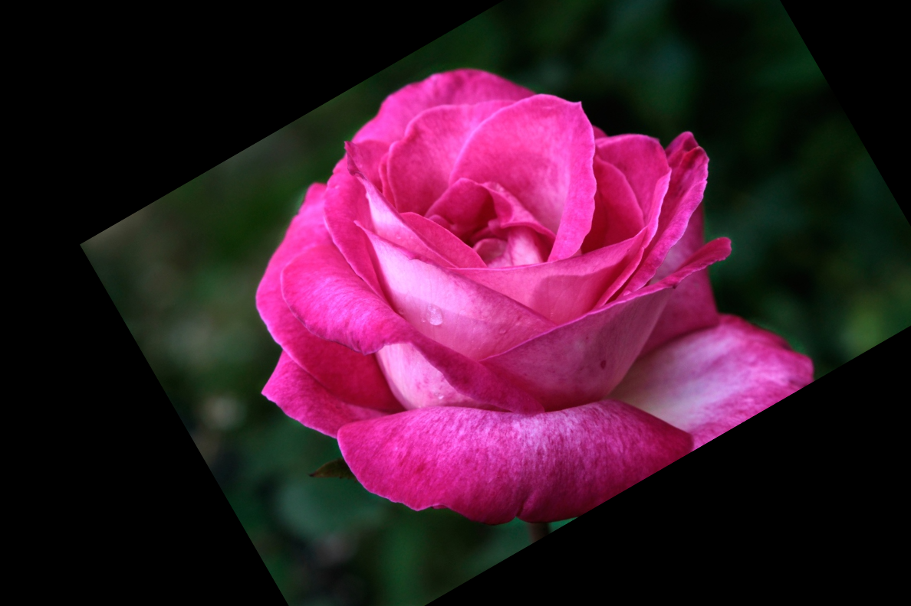

# E02. OpenCV 실습 과제

## 0. 과제 개요

이번 과제에서는 OpenCV를 사용하여 **카메라 보정(Camera Calibration)**,  
**기하학적 변환(Transform)**, **시차(Disparity) 및 깊이(Depth) 계산**을 구현합니다.

---

## 요구사항 및 설치

- Python 3.7 이상
- OpenCV (`opencv-python`)
- NumPy (`numpy`)

설치

```bash
pip install opencv-python numpy
```

---

## 폴더 구조 (요약)

```
E02_OpenCV/
│
├── images/
│   ├── rose.png
│   ├── left.png
│   ├── right.png
│   └── calibration_images/
│       ├── left01.jpg
│       ├── left02.jpg
│       └── ...
│
├── init_code/
│   ├── 01.Calibration.py
│   ├── 02.Transform.py
│   ├── 03.Depth.py
│   └── outputs/
│
├── outputs/
│   ├── 02_rose_original.png
│   ├── 02_rose_transformed.png
│   ├── 03_depth_color.png
│   ├── 03_disparity_color.png
│   ├── 03_left_roi.png
│   └── 03_right_roi.png
│
└── README.md
```

- `01.Calibration.py` : 체커보드 이미지를 이용한 카메라 보정
- `02.Transform.py` : 이미지 회전, 축소, 평행이동 변환
- `03.Depth.py` : Stereo Matching을 이용한 disparity 및 depth 계산
---

# 실행 방법

```bash
python init_code/01.Calibration.py
python init_code/02.Transform.py
python init_code/03.Depth.py
```

또는

```bash
python 01.Calibration.py
python 02.Transform.py
python 03.Depth.py
```

---

# Problem 1 — Camera Calibration

체커보드 이미지를 이용하여 **카메라 내부 파라미터**를 추정하는 과정입니다.

---

## 주요 내용

- **체커보드 코너 검출**
- **Sub-pixel 단위 코너 정밀화**
- **카메라 행렬 (Camera Matrix) 계산**
- **왜곡 계수 (Distortion Coefficients) 계산**
- **보정된 이미지 (Undistorted Image) 확인**

---

## 실행 결과

카메라 보정이 완료되면 콘솔에 다음과 같이 내부 파라미터가 출력됩니다.

<figure>
  
  <figcaption>원본 이미지와 Grayscale 변환 결과</figcaption>
</figure>

---

<details>
<summary>전체 코드 — 01.Calibration.py</summary>

```python
# 01.Calibration.py
# 체커보드 이미지를 이용하여 카메라 내부 파라미터(Camera Matrix)와
# 렌즈 왜곡 계수(Distortion Coefficients)를 계산하는 카메라 보정 예제

import cv2                     # OpenCV 라이브러리 (이미지 처리 및 카메라 보정 기능 사용)
import numpy as np             # 수치 계산 및 배열 처리를 위한 NumPy
import glob                    # 특정 패턴의 파일 목록을 가져오기 위한 라이브러리
import os                      # 파일 및 경로 처리를 위한 표준 라이브러리

# 체크보드 내부 코너 개수 (가로 9개, 세로 6개)
CHECKERBOARD = (9, 6)

# 체크보드 한 칸의 실제 크기 (mm 단위)
square_size = 25.0

# 코너 정밀화를 위한 반복 조건 설정
# (최대 30번 반복 또는 정확도 0.001 도달 시 종료)
criteria = (cv2.TERM_CRITERIA_EPS + cv2.TERM_CRITERIA_MAX_ITER, 30, 0.001)

# 실제 세계 좌표(3D 좌표)를 저장할 배열 생성
# (체커보드 코너 개수 × 3차원 좌표)
objp = np.zeros((CHECKERBOARD[0] * CHECKERBOARD[1], 3), np.float32)

# 체커보드의 2D 좌표를 생성 (z=0인 평면 위의 좌표)
objp[:, :2] = np.mgrid[0:CHECKERBOARD[0], 0:CHECKERBOARD[1]].T.reshape(-1, 2)

# 실제 크기를 반영하기 위해 square_size를 곱함
objp *= square_size

# 모든 이미지의 3D 실제 좌표를 저장할 리스트
objpoints = []

# 모든 이미지의 2D 이미지 좌표를 저장할 리스트
imgpoints = []

# 현재 실행 중인 파이썬 파일의 절대 경로를 가져옴
base_dir = os.path.dirname(os.path.abspath(__file__))

# calibration_images 폴더에 있는 체커보드 이미지 패턴 설정
image_pattern = os.path.join(base_dir, "..", "images", "calibration_images", "left*.jpg")

# 위 패턴에 해당하는 모든 이미지 파일을 리스트로 가져옴
images = glob.glob(image_pattern)

# 이미지 크기를 저장할 변수
img_size = None


# ----------------------------------
# 체커보드 코너 검출
# ----------------------------------
for fname in images:                    # 모든 calibration 이미지 반복

    img = cv2.imread(fname)             # 이미지 파일 읽기

    if img is None:                     # 이미지 로드 실패 시
        print(f"이미지 로드 실패: {fname}")   # 오류 메시지 출력
        continue                        # 다음 이미지로 넘어감

    gray = cv2.cvtColor(img, cv2.COLOR_BGR2GRAY)   # 이미지를 그레이스케일로 변환

    img_size = gray.shape[::-1]         # 이미지 크기 저장 (width, height)

    # 체커보드 코너 검출
    ret, corners = cv2.findChessboardCorners(gray, CHECKERBOARD, None)

    if ret:                             # 코너 검출 성공 시

        objpoints.append(objp)          # 실제 좌표 추가

        # 코너 위치를 Sub-pixel 단위로 정밀화
        corners2 = cv2.cornerSubPix(gray, corners, (11, 11), (-1, -1), criteria)

        imgpoints.append(corners2)      # 이미지 좌표 추가

        vis = img.copy()                # 시각화를 위해 이미지 복사

        # 검출된 체커보드 코너를 이미지에 표시
        cv2.drawChessboardCorners(vis, CHECKERBOARD, corners2, ret)

        cv2.imshow("Chessboard Corners", vis)  # 화면에 코너 표시
        cv2.waitKey(300)                        # 300ms 동안 화면 유지

    else:                              # 코너 검출 실패 시
        print(f"코너 검출 실패: {fname}")      # 실패 메시지 출력


# 모든 OpenCV 창 닫기
cv2.destroyAllWindows()


# 이미지가 하나도 없는 경우 오류 발생
if len(images) == 0:
    raise FileNotFoundError(f"이미지를 찾지 못했습니다: {image_pattern}")

# 코너 검출 성공 이미지가 없는 경우 오류 발생
if len(objpoints) == 0 or len(imgpoints) == 0:
    raise ValueError("체크보드 코너를 검출한 이미지가 없습니다.")


# ----------------------------------
# 카메라 보정(Camera Calibration)
# ----------------------------------
ret, K, dist, rvecs, tvecs = cv2.calibrateCamera(
    objpoints,      # 실제 세계 좌표
    imgpoints,      # 이미지 좌표
    img_size,       # 이미지 크기
    None,
    None
)


# 카메라 내부 행렬 출력
print("Camera Matrix K:")
print(K)

# 렌즈 왜곡 계수 출력
print("\nDistortion Coefficients:")
print(dist)


# ----------------------------------
# 왜곡 보정 테스트
# ----------------------------------
test_img = cv2.imread(images[0])        # 첫 번째 이미지를 테스트용으로 사용

if test_img is None:                    # 이미지 로드 실패 시
    raise FileNotFoundError(f"테스트 이미지를 불러올 수 없습니다: {images[0]}")

# 왜곡 보정 적용
undistorted = cv2.undistort(test_img, K, dist)

# 원본 이미지 출력
cv2.imshow("Original Image", test_img)

# 왜곡이 보정된 이미지 출력
cv2.imshow("Undistorted Image", undistorted)

# 키 입력이 있을 때까지 대기
cv2.waitKey(0)

# 모든 OpenCV 창 닫기
cv2.destroyAllWindows()
```

</details>

---

# Problem 2 — Image Transform

주어진 이미지를 대상으로 **회전(Rotation)**, **스케일(Scaling)**, **평행이동(Translation)** 을 적용하는 문제입니다.

---

## 적용한 변환

- **회전 (Rotation)** : 30°
- **스케일 (Scaling)** : 0.8배
- **평행이동 (Translation)** : x +80, y -40

---

## 실행 결과

<figure>  <figcaption>변환 전 원본 이미지</figcaption> </figure> <figure>  <figcaption>회전, 축소, 평행이동이 적용된 결과 이미지</figcaption> </figure>

---

<details>
<summary>전체 코드 — 02.Transform.py</summary>

```python
# 02.Transform.py
# OpenCV의 Affine 변환을 이용하여 이미지를 회전, 축소하고
# 평행이동(translation)을 적용하는 기하학적 변환 예제

# OpenCV 라이브러리 불러오기 (이미지 처리용)
import cv2

# 파일 경로를 편하게 다루기 위한 Path 라이브러리
from pathlib import Path


# 현재 실행 중인 파이썬 파일(02.Transform.py)의 폴더 경로를 가져옴
base_dir = Path(__file__).resolve().parent

# 이미지 폴더 안에 있는 rose.png 파일 경로 생성
# base_dir의 상위 폴더(E02_OpenCV) → images → rose.png
image_path = base_dir.parent / "images" / "rose.png"

# 결과 이미지를 저장할 outputs 폴더 경로 생성
output_dir = base_dir.parent / "outputs"

# outputs 폴더가 없으면 새로 생성
output_dir.mkdir(parents=True, exist_ok=True)


# 이미지 파일을 읽어서 img 변수에 저장
img = cv2.imread(str(image_path))

# 만약 이미지가 제대로 불러와지지 않으면 오류 발생
if img is None:
    raise FileNotFoundError(f"이미지를 찾지 못했습니다: {image_path}")


# 이미지의 높이(height)와 너비(width)를 가져옴
h, w = img.shape[:2]

# 이미지 중심 좌표 계산 (회전의 기준점으로 사용)
center = (w // 2, h // 2)


# -----------------------------
# 1. 회전 + 스케일 변환
#    - 30도 회전
#    - 0.8배 축소
# -----------------------------

# 회전 + 스케일 변환 행렬 생성
# center : 회전 중심
# 30 : 회전 각도 (도 단위)
# 0.8 : 이미지 크기를 80%로 축소
M = cv2.getRotationMatrix2D(center, 30, 0.8)


# -----------------------------
# 2. 평행이동 추가
#    - x 방향 +80
#    - y 방향 -40
# -----------------------------

# x 방향으로 80픽셀 이동 (오른쪽 이동)
M[0, 2] += 80

# y 방향으로 -40픽셀 이동 (위쪽 이동)
M[1, 2] -= 40


# -----------------------------
# 3. Affine 변환 적용
# -----------------------------

# 위에서 만든 변환 행렬 M을 이용해 이미지에 Affine 변환 적용
# (회전 + 스케일 + 이동이 동시에 적용됨)
transformed = cv2.warpAffine(img, M, (w, h))


# -----------------------------
# 4. 결과 이미지 저장
# -----------------------------

# 원본 이미지를 outputs 폴더에 저장
cv2.imwrite(str(output_dir / "02_rose_original.png"), img)

# 변환된 이미지를 outputs 폴더에 저장
cv2.imwrite(str(output_dir / "02_rose_transformed.png"), transformed)


# -----------------------------
# 5. 화면에 이미지 출력
# -----------------------------

# 원본 이미지 창 표시
cv2.imshow("Original Image", img)

# 변환된 이미지 창 표시
cv2.imshow("Transformed Image", transformed)

# 키 입력이 있을 때까지 창 유지
cv2.waitKey(0)

# 모든 OpenCV 창 닫기
cv2.destroyAllWindows()
```

</details>

---

# Problem 3 — Disparity and Depth Estimation

좌/우 스테레오 이미지를 이용하여 **시차(disparity)** 를 계산하고,  
이를 기반으로 **깊이(depth)** 를 추정하는 문제입니다.

---

## 주요 과정

1. 좌/우 이미지 불러오기  
2. 그레이스케일 변환  
3. **StereoBM** 알고리즘으로 disparity 계산  
4. 깊이 계산  

**Z = (f × B) / d**

5. ROI별 평균 disparity / depth 비교  
6. 가장 가까운 물체와 가장 먼 물체 판단  

---

## 사용 파라미터

| 파라미터 | 설명 | 값 |
|---|---|---|
| f | 카메라 초점거리 (Focal Length) | 700.0 |
| B | 두 카메라 사이 거리 (Baseline) | 0.12 |

---

## ROI (관심 영역)

분석을 위해 다음 3개의 영역을 선택했습니다.

- **Painting**
- **Frog**
- **Teddy**

## 실행 결과

| Original | Disparity map |
|----------|---------------|
|  |  |

---

<details>
<summary>전체 코드 — cv03_roi.py</summary>

```python
# 03.Depth.py
# 좌/우 스테레오 이미지를 이용하여 disparity(시차)를 계산하고
# Z = (f × B) / d 공식을 통해 depth(깊이)를 추정하는 스테레오 비전 예제

import cv2  # OpenCV 라이브러리 (이미지 처리용)
import numpy as np  # 수치 계산 및 배열 처리를 위한 NumPy

# 좌/우 이미지 불러오기
left_color = cv2.imread(r"D:/computer-vision/E02_OpenCV/images/left.png")  # 왼쪽 카메라 이미지 읽기
right_color = cv2.imread(r"D:/computer-vision/E02_OpenCV/images/right.png")  # 오른쪽 카메라 이미지 읽기

# 이미지가 제대로 로드되지 않았을 경우 예외 처리
if left_color is None or right_color is None:
    raise FileNotFoundError("좌/우 이미지를 찾지 못했습니다.")  # 이미지 파일이 없으면 오류 발생

# 카메라 파라미터
f = 700.0  # 카메라 초점거리 (focal length)
B = 0.12  # 두 카메라 사이 거리 (baseline)

# ROI 설정 (관심 영역: Painting, Frog, Teddy)
rois = {
    "Painting": (55, 50, 130, 110),  # (x, y, width, height)
    "Frog": (90, 265, 230, 95),  # Frog 영역 좌표
    "Teddy": (310, 35, 115, 90)  # Teddy 영역 좌표
}

# -----------------------------
# 그레이스케일 변환
# -----------------------------
left_gray = cv2.cvtColor(left_color, cv2.COLOR_BGR2GRAY)  # 왼쪽 이미지를 그레이스케일로 변환
right_gray = cv2.cvtColor(right_color, cv2.COLOR_BGR2GRAY)  # 오른쪽 이미지를 그레이스케일로 변환

# -----------------------------
# 1. Disparity 계산
# -----------------------------
stereo = cv2.StereoBM_create(numDisparities=16*6, blockSize=15)  # Stereo Block Matching 객체 생성
disparity = stereo.compute(left_gray, right_gray).astype(np.float32) / 16.0  # 두 이미지의 시차(disparity) 계산

# -----------------------------
# 2. Depth 계산
# Z = fB / d
# -----------------------------
depth_map = np.zeros_like(disparity, dtype=np.float32)  # disparity와 같은 크기의 depth 배열 생성
valid_mask = disparity > 0  # disparity가 0보다 큰 유효한 영역만 선택
depth_map[valid_mask] = (f * B) / disparity[valid_mask]  # 깊이(depth) 계산 공식 적용

# -----------------------------
# 3. ROI별 평균 disparity / depth 계산
# -----------------------------
results = {}  # ROI별 결과를 저장할 딕셔너리 생성

for name, (x, y, w, h) in rois.items():  # 각 ROI 영역 반복

    roi_disp = disparity[y:y+h, x:x+w]  # ROI 영역의 disparity 값 추출
    roi_depth = depth_map[y:y+h, x:x+w]  # ROI 영역의 depth 값 추출

    roi_valid = roi_disp > 0  # disparity 값이 유효한 픽셀만 선택

    if np.any(roi_valid):  # 유효한 픽셀이 하나라도 있는 경우
        mean_disp = np.mean(roi_disp[roi_valid])  # ROI 영역의 평균 disparity 계산
        mean_depth = np.mean(roi_depth[roi_valid])  # ROI 영역의 평균 depth 계산
    else:  # 유효한 disparity가 없는 경우
        mean_disp = np.nan  # Not a Number로 처리
        mean_depth = np.nan

    results[name] = {  # 결과 딕셔너리에 저장
        "mean_disparity": mean_disp,
        "mean_depth": mean_depth
    }

# -----------------------------
# 4. 결과 출력 (PPT처럼)
# -----------------------------
closest_roi = max(results.items(), key=lambda x: x[1]["mean_disparity"])[0]  # disparity가 가장 큰 ROI (가장 가까운 물체)
farthest_roi = min(results.items(), key=lambda x: x[1]["mean_disparity"])[0]  # disparity가 가장 작은 ROI (가장 먼 물체)

print("가장 가까운 ROI:", closest_roi)  # 가장 가까운 ROI 출력
print("가장 먼 ROI:", farthest_roi)  # 가장 먼 ROI 출력

# -----------------------------
# 5. disparity 시각화
# -----------------------------
disp_tmp = disparity.copy()  # disparity 배열 복사
disp_tmp[disp_tmp <= 0] = np.nan  # 0 이하 값은 NaN으로 처리 (유효하지 않은 값 제거)

d_min = np.nanpercentile(disp_tmp, 5)  # disparity의 하위 5% 값 계산
d_max = np.nanpercentile(disp_tmp, 95)  # disparity의 상위 95% 값 계산

disp_scaled = (disp_tmp - d_min) / (d_max - d_min)  # disparity 값을 0~1 범위로 정규화
disp_scaled = np.clip(disp_scaled, 0, 1)  # 값 범위를 0~1로 제한

disp_vis = np.zeros_like(disparity, dtype=np.uint8)  # 시각화용 disparity 배열 생성
valid_disp = ~np.isnan(disp_tmp)  # NaN이 아닌 유효한 disparity 영역 선택
disp_vis[valid_disp] = (disp_scaled[valid_disp] * 255).astype(np.uint8)  # 0~255 범위로 변환

disparity_color = cv2.applyColorMap(disp_vis, cv2.COLORMAP_JET)  # 컬러맵 적용 (JET 색상)

# -----------------------------
# 화면 출력 (PPT 스타일)
# -----------------------------
cv2.imshow("Original", left_color)  # 원본 왼쪽 이미지 출력
cv2.imshow("Disparity map", disparity_color)  # disparity 컬러맵 이미지 출력

cv2.waitKey(0)  # 키 입력이 있을 때까지 대기
cv2.destroyAllWindows()  # 모든 OpenCV 창 닫기
```

</details>

---


