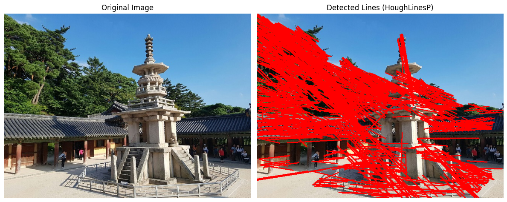
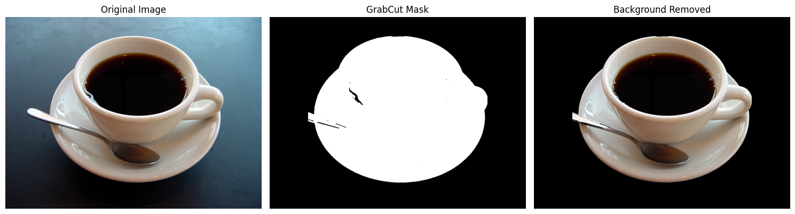

# E03. OpenCV 실습 과제

## 0. 과제 개요

이번 과제에서는 OpenCV를 사용하여 **에지 검출(Edge Detection)**과  
**직선 검출(Line Detection)**, **영역 분할(Region Segmentation)**을 구현합니다.

- Sobel 필터를 이용한 에지 검출
- Canny + Hough Transform을 이용한 직선 검출
- GrabCut을 이용한 객체 분할 및 배경 제거

---

## 요구사항 및 설치

- Python 3.7 이상
- OpenCV (`opencv-python`)
- NumPy (`numpy`)
- Matplotlib (`matplotlib`)

설치

```bash
pip install opencv-python numpy matplotlib
```

---

## 폴더 구조 (요약)

```
E03_Edge and Region/
│
├── images/
│   ├── edgeDetectionImage.jpg
│   ├── dabo.jpg
│   └── coffee cup.JPG
│
├── outputs/
│   ├── 01_sobel_result.png
│   ├── 02_hough_lines.png
│   └── 03_grabcut_result.png
│
├── cv01_sobel.py
├── cv02_hough.py
├── cv03_grabcut.py
│
└── README.md
```

- `cv01_sobel.py` : Sobel 필터를 이용한 에지 검출 및 시각화
- `cv02_hough.py` : Canny + Hough Transform을 이용한 직선 검출
- `cv03_grabcut.py` : GrabCut을 이용한 객체 분할 및 배경 제거

---

# 실행 방법

```bash
python E03_Edge and Region/cv01_sobel.py
python E03_Edge and Region/cv02_hough.py
python E03_Edge and Region/cv03_grabcut.py
```

또는

```bash
python cv01_sobel.py
python cv02_hough.py
python cv03_grabcut.py
```

---

# Problem 1 — Sobel Edge Detection

이미지를 그레이스케일로 변환한 후 **Sobel 필터를 사용하여 에지를 검출**하는 과정입니다.

---

## 주요 내용

- **이미지 그레이스케일 변환**
- **Sobel 필터를 이용한 x 방향 에지 검출**
- **Sobel 필터를 이용한 y 방향 에지 검출**
- **에지 강도 (Magnitude) 계산**
- **에지 이미지 시각화**

---

### 실행 결과

#### Original Image (원본 이미지)


---

#### Sobel Edge Magnitude (에지 강도 이미지)


---

<details>
<summary>전체 코드 — cv01_sobel.py</summary>

```python
#cv01_sobel.py
import cv2 as cv                      # OpenCV 라이브러리 (이미지 처리)
import numpy as np                   # 수치 연산용 라이브러리
import matplotlib.pyplot as plt      # 결과 시각화를 위한 라이브러리
import os                            # 파일/폴더 경로 관련 라이브러리

# =========================
# 1. 이미지 경로 설정
# =========================
image_path = r"D:/computer-vision/E03_Edge and Region/images/edgeDetectionImage.jpg"  # 입력 이미지 경로
output_path = r"D:/computer-vision/E03_Edge and Region/outputs/01_sobel_result.png"   # 결과 저장 경로

# =========================
# 2. 이미지 불러오기
# =========================
img_bgr = cv.imread(image_path)      # 이미지를 BGR 형식으로 읽어옴

# 이미지가 정상적으로 로드되지 않았을 경우 예외 처리
if img_bgr is None:
    raise FileNotFoundError(f"이미지를 찾을 수 없습니다: {image_path}")

# =========================
# 3. 색상 변환
# =========================
img_rgb = cv.cvtColor(img_bgr, cv.COLOR_BGR2RGB)   # Matplotlib 출력용으로 BGR → RGB 변환
gray = cv.cvtColor(img_bgr, cv.COLOR_BGR2GRAY)     # Sobel 적용을 위한 그레이스케일 변환

# =========================
# 4. Sobel 에지 검출
# =========================
# x 방향 에지 검출 (수직 방향 변화 감지)
sobel_x = cv.Sobel(gray, cv.CV_64F, 1, 0, ksize=3)

# y 방향 에지 검출 (수평 방향 변화 감지)
sobel_y = cv.Sobel(gray, cv.CV_64F, 0, 1, ksize=3)

# =========================
# 5. 에지 강도 계산
# =========================
# x, y 방향 에지를 결합하여 전체 에지 강도 계산
magnitude = cv.magnitude(sobel_x, sobel_y)

# float64 → uint8 변환 (이미지로 표현 가능하게)
magnitude_abs = cv.convertScaleAbs(magnitude)

# =========================
# 6. 출력 폴더 생성
# =========================
# outputs 폴더가 없으면 자동 생성
os.makedirs(os.path.dirname(output_path), exist_ok=True)

# =========================
# 7. 결과 시각화
# =========================
plt.figure(figsize=(12, 5))   # 전체 출력 크기 설정

# (1) 원본 이미지 출력
plt.subplot(1, 2, 1)
plt.imshow(img_rgb)
plt.title("Original Image")
plt.axis("off")               # 축 제거

# (2) Sobel 에지 강도 이미지 출력
plt.subplot(1, 2, 2)
plt.imshow(magnitude_abs, cmap="gray")  # 흑백 이미지로 출력
plt.title("Sobel Edge Magnitude")
plt.axis("off")

plt.tight_layout()            # 레이아웃 자동 정리

# =========================
# 8. 결과 저장 및 출력
# =========================
plt.savefig(output_path, bbox_inches="tight")  # 이미지 파일로 저장
plt.show()                                    # 화면에 출력

# 저장 완료 메시지 출력
print("저장 완료:", output_path)
```

</details>

---

## Problem 2 — Canny Edge & Hough Line Detection

이미지에서 에지를 검출한 후 **Hough 변환을 이용하여 직선을 검출**하는 문제입니다.

### 적용한 처리

- Canny Edge Detection : threshold1 = 100, threshold2 = 200  
- HoughLinesP를 이용한 직선 검출  
- 검출된 직선을 빨간색으로 시각화  

---

## 실행 결과

<figure>
  
  <figcaption>Hough Transform을 이용한 직선 검출 결과</figcaption>
</figure>

---

<details>
<summary>전체 코드 — cv02_hough.py</summary>

```python
#cv02_hough.py
import cv2 as cv                      # OpenCV 라이브러리 (이미지 처리)
import numpy as np                   # 수치 연산 라이브러리
import matplotlib.pyplot as plt      # 결과 시각화를 위한 라이브러리
import os                            # 파일/폴더 경로 처리용 라이브러리

# =========================
# 1. 이미지 경로 설정
# =========================
image_path = r"D:/computer-vision/E03_Edge and Region/images/dabo.jpg"   # 입력 이미지 경로
output_path = r"D:/computer-vision/E03_Edge and Region/outputs/02_hough_lines.png"  # 결과 저장 경로

# =========================
# 2. 이미지 불러오기
# =========================
img_bgr = cv.imread(image_path)      # 이미지를 BGR 형식으로 불러옴

# 이미지가 정상적으로 로드되지 않았을 경우 예외 처리
if img_bgr is None:
    raise FileNotFoundError(f"이미지를 찾을 수 없습니다: {image_path}")

# =========================
# 3. 원본 이미지 복사
# =========================
line_img = img_bgr.copy()            # 직선을 그릴 이미지를 별도로 복사

# =========================
# 4. 전처리 (그레이스케일 변환)
# =========================
gray = cv.cvtColor(img_bgr, cv.COLOR_BGR2GRAY)   # Canny 적용을 위해 흑백 이미지로 변환

# =========================
# 5. Canny 에지 검출
# =========================
edges = cv.Canny(gray, 100, 200)    # threshold1=100, threshold2=200으로 에지 검출

# =========================
# 6. Hough 변환을 이용한 직선 검출
# =========================
lines = cv.HoughLinesP(
    edges,                          # 입력: 에지 이미지
    rho=1,                          # 거리 해상도 (픽셀 단위)
    theta=np.pi / 180,              # 각도 해상도 (라디안 단위)
    threshold=80,                   # 최소 교차점 수 (값이 클수록 엄격)
    minLineLength=50,               # 최소 직선 길이
    maxLineGap=10                   # 선 사이 최대 허용 간격
)

# =========================
# 7. 검출된 직선 그리기
# =========================
if lines is not None:               # 직선이 검출된 경우
    for line in lines:              # 각 직선에 대해 반복
        x1, y1, x2, y2 = line[0]   # 시작점(x1,y1), 끝점(x2,y2) 추출
        cv.line(line_img, (x1, y1), (x2, y2), (0, 0, 255), 2)  # 빨간색(0,0,255), 두께 2로 선 그리기

# =========================
# 8. 색상 변환 (BGR → RGB)
# =========================
img_rgb = cv.cvtColor(img_bgr, cv.COLOR_BGR2RGB)         # 원본 이미지 변환
line_img_rgb = cv.cvtColor(line_img, cv.COLOR_BGR2RGB)   # 직선이 그려진 이미지 변환

# =========================
# 9. 출력 폴더 생성
# =========================
os.makedirs(os.path.dirname(output_path), exist_ok=True)  # outputs 폴더가 없으면 생성

# =========================
# 10. 결과 시각화
# =========================
plt.figure(figsize=(12, 5))       # 전체 출력 크기 설정

# (1) 원본 이미지 출력
plt.subplot(1, 2, 1)
plt.imshow(img_rgb)
plt.title("Original Image")
plt.axis("off")                   # 축 제거

# (2) 직선 검출 결과 출력
plt.subplot(1, 2, 2)
plt.imshow(line_img_rgb)
plt.title("Detected Lines (HoughLinesP)")
plt.axis("off")

plt.tight_layout()                # 레이아웃 자동 정리

# =========================
# 11. 결과 저장 및 출력
# =========================
plt.savefig(output_path, bbox_inches="tight")  # 결과 이미지 저장
plt.show()                                    # 화면에 출력

# =========================
# 12. 결과 정보 출력
# =========================
print("저장 완료:", output_path)  # 저장 경로 출력

# 검출된 직선 개수 출력
if lines is not None:
    print("검출된 직선 개수:", len(lines))
else:
    print("검출된 직선이 없습니다.")
```

</details>

---

# Problem 3 — GrabCut Segmentation

이미지에서 객체가 포함된 영역을 설정한 후  
**GrabCut 알고리즘을 이용하여 전경을 추출하고 배경을 제거하는 문제입니다.**

---

## 주요 과정

1. 이미지 불러오기  
2. 초기 사각형 영역(Rectangle) 설정  
3. GrabCut 알고리즘 적용  
4. 마스크 생성 (배경 / 전경 분리)  
5. 마스크를 이용하여 배경 제거  
6. 결과 이미지 시각화  

---

## 핵심 개념

- GrabCut은 **그래프 기반 분할 알고리즘**
- 초기 사각형을 기준으로 전경/배경을 반복적으로 분리
- 마스크 값을 이용하여 최종 결과 생성

---

## 실행 결과

<figure>
  
  <figcaption>원본 이미지</figcaption>
</figure>

<figure>
  
  <figcaption>배경이 제거된 객체 추출 결과</figcaption>
</figure>

---

## 결과 설명

- 초기 사각형 영역을 기반으로 객체(컵)를 전경으로 분리
- 배경 영역은 제거되어 검은색으로 표현됨
- GrabCut을 통해 **객체 경계가 비교적 정확하게 추출됨**

---

<details>
<summary>전체 코드 — cv03_grabcut.py</summary>

```python
#cv03_grabcut.py
import cv2 as cv                      # OpenCV 라이브러리 (이미지 처리)
import numpy as np                   # 수치 연산 라이브러리
import matplotlib.pyplot as plt      # 결과 시각화를 위한 라이브러리
import os                            # 파일/폴더 경로 처리용 라이브러리

# =========================
# 1. 이미지 경로 설정
# =========================
image_path = r"D:/computer-vision/E03_Edge and Region/images/coffee cup.JPG"   # 입력 이미지 경로
output_path = r"D:/computer-vision/E03_Edge and Region/outputs/03_grabcut_result.png"  # 결과 저장 경로

# =========================
# 2. 이미지 불러오기
# =========================
img_bgr = cv.imread(image_path)      # 이미지를 BGR 형식으로 불러옴

# 이미지가 정상적으로 로드되지 않았을 경우 예외 처리
if img_bgr is None:
    raise FileNotFoundError(f"이미지를 찾을 수 없습니다: {image_path}")

# =========================
# 3. 색상 변환
# =========================
img_rgb = cv.cvtColor(img_bgr, cv.COLOR_BGR2RGB)   # Matplotlib 출력용으로 BGR → RGB 변환

# =========================
# 4. GrabCut 초기 설정
# =========================
mask = np.zeros(img_bgr.shape[:2], np.uint8)   # 이미지 크기에 맞는 초기 마스크 생성 (모두 0으로 초기화)

# GrabCut 알고리즘에서 사용하는 배경/전경 모델 초기화
bgdModel = np.zeros((1, 65), np.float64)   # 배경 모델
fgdModel = np.zeros((1, 65), np.float64)   # 전경 모델

# =========================
# 5. 초기 사각형 영역 설정
# =========================
h, w = img_bgr.shape[:2]   # 이미지 높이(h), 너비(w) 추출

# 객체가 포함되도록 사각형 영역 설정 (x, y, width, height)
rect = (int(w * 0.15), int(h * 0.10), int(w * 0.70), int(h * 0.80))

# =========================
# 6. GrabCut 실행
# =========================
cv.grabCut(
    img_bgr,               # 입력 이미지
    mask,                  # 초기 마스크
    rect,                  # 초기 사각형 영역
    bgdModel,              # 배경 모델
    fgdModel,              # 전경 모델
    5,                     # 반복 횟수 (클수록 정밀하지만 느림)
    cv.GC_INIT_WITH_RECT   # 사각형 기반 초기화 방식
)

# =========================
# 7. 마스크 후처리 (0/1 변환)
# =========================
# 배경(GC_BGD)과 배경 가능성(GC_PR_BGD)은 0
# 전경(GC_FGD)과 전경 가능성(GC_PR_FGD)은 1로 변환
mask2 = np.where(
    (mask == cv.GC_BGD) | (mask == cv.GC_PR_BGD),
    0,
    1
).astype("uint8")

# =========================
# 8. 배경 제거
# =========================
# 마스크를 RGB 이미지에 곱하여 배경 제거
result = img_rgb * mask2[:, :, np.newaxis]

# 마스크를 시각화하기 위해 0~255 범위로 변환
mask_display = mask2 * 255

# =========================
# 9. 출력 폴더 생성
# =========================
os.makedirs(os.path.dirname(output_path), exist_ok=True)  # outputs 폴더 없으면 생성

# =========================
# 10. 결과 시각화
# =========================
plt.figure(figsize=(15, 5))   # 전체 출력 크기 설정

# (1) 원본 이미지 출력
plt.subplot(1, 3, 1)
plt.imshow(img_rgb)
plt.title("Original Image")
plt.axis("off")

# (2) GrabCut 마스크 출력
plt.subplot(1, 3, 2)
plt.imshow(mask_display, cmap="gray")   # 흑백 이미지로 표시
plt.title("GrabCut Mask")
plt.axis("off")

# (3) 배경 제거 결과 출력
plt.subplot(1, 3, 3)
plt.imshow(result)
plt.title("Background Removed")
plt.axis("off")

plt.tight_layout()   # 레이아웃 자동 정리

# =========================
# 11. 결과 저장 및 출력
# =========================
plt.savefig(output_path, bbox_inches="tight")  # 결과 이미지 저장
plt.show()                                    # 화면에 출력

# =========================
# 12. 결과 정보 출력
# =========================
print("저장 완료:", output_path)        # 저장 경로 출력
print("사용한 초기 사각형(rect):", rect)  # 사용된 rect 값 출력
```

</details>

---

