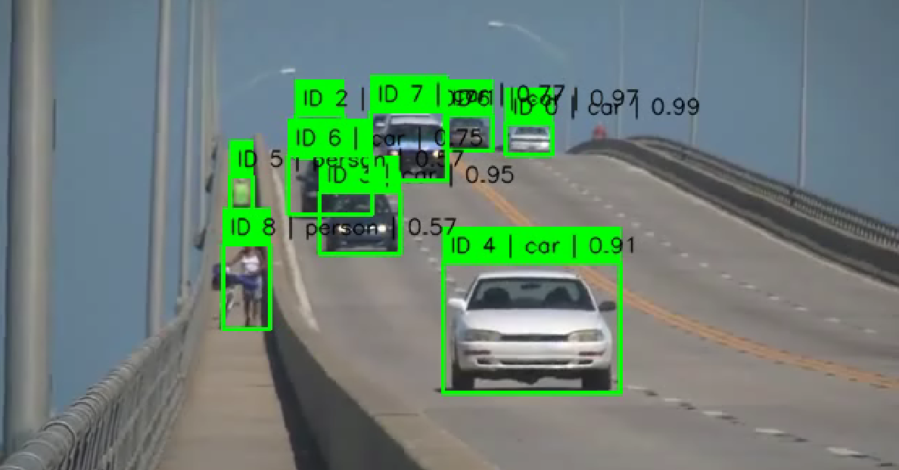
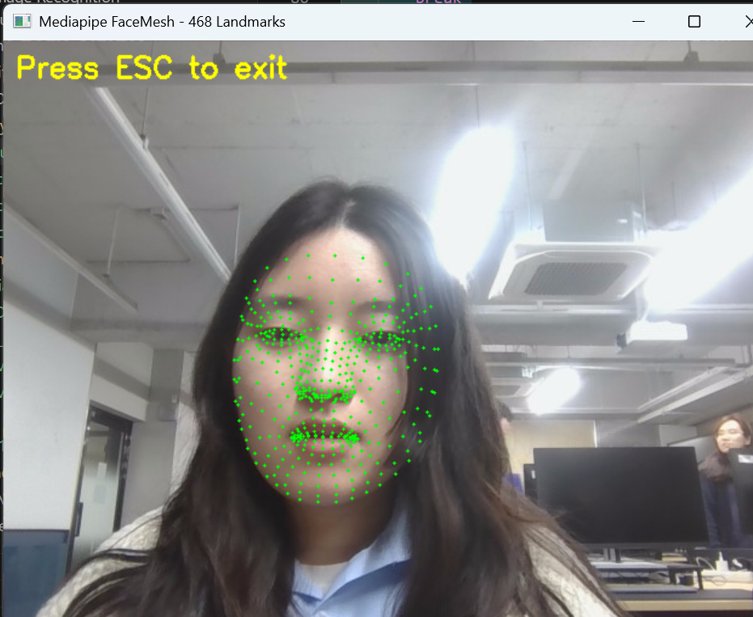

# E06. Dynamic Vision

컴퓨터비전 실습 - 동적 객체 추적 및 얼굴 랜드마크 분석

---

## 📌 과제 개요

본 실습은 영상에서 시간 흐름에 따라 객체와 얼굴 특징점을 추적하는 두 가지 작업을 구현한다.

### 1️⃣ YOLOv3 + SORT 객체 추적
- YOLOv3 기반 객체 검출
- SORT 알고리즘으로 객체 ID 유지
- 교통 영상 내 객체 지속 추적

### 2️⃣ MediaPipe Face Mesh
- 웹캠 기반 얼굴 랜드마크 검출
- 468개 얼굴 특징점 추출 및 시각화

---

## 🧠 01. YOLOv3 + SORT 객체 추적

<details>
<summary>🔍 코드 보기</summary>

```python
# 01_sort_yolo_tracking.py
# /E06_Dynamic Vision/01_sort_yolo_tracking.py

# 운영체제의 파일/폴더 경로를 다루기 위한 os 모듈 불러오기
import os

# OpenCV 라이브러리를 cv2라는 이름으로 불러오기
import cv2

# 수치 계산과 배열 처리를 위한 numpy 불러오기
import numpy as np

# 헝가리안 알고리즘(최적 매칭)을 사용하기 위한 함수 불러오기
from scipy.optimize import linear_sum_assignment


# ============================================================
# 1. 경로 설정
# ============================================================

# 현재 파이썬 파일이 있는 폴더의 절대 경로를 구함
BASE_DIR = os.path.dirname(os.path.abspath(__file__))

# 입력 비디오 파일 경로를 현재 폴더 기준으로 설정
VIDEO_PATH = os.path.join(BASE_DIR, "slow_traffic_small.mp4")

# YOLOv3 설정 파일 경로를 현재 폴더 기준으로 설정
CFG_PATH = os.path.join(BASE_DIR, "yolov3.cfg")

# YOLOv3 가중치 파일 경로를 현재 폴더 기준으로 설정
WEIGHTS_PATH = os.path.join(BASE_DIR, "yolov3.weights")

# 결과 영상을 저장할 outputs 폴더 경로를 설정
OUTPUT_DIR = os.path.join(BASE_DIR, "outputs")

# 최종 출력 비디오 파일 경로를 설정
OUTPUT_VIDEO_PATH = os.path.join(OUTPUT_DIR, "tracked_output.mp4")

# outputs 폴더가 없으면 생성하고, 이미 있으면 그대로 둠
os.makedirs(OUTPUT_DIR, exist_ok=True)


# ============================================================
# 2. COCO 클래스 이름
#    YOLOv3 기본 가중치는 COCO 데이터셋 기준
# ============================================================

# COCO 데이터셋의 클래스 이름 80개를 리스트로 정의
COCO_CLASSES = [
    "person", "bicycle", "car", "motorbike", "aeroplane", "bus", "train", "truck", "boat", "traffic light",
    "fire hydrant", "stop sign", "parking meter", "bench", "bird", "cat", "dog", "horse", "sheep", "cow",
    "elephant", "bear", "zebra", "giraffe", "backpack", "umbrella", "handbag", "tie", "suitcase", "frisbee",
    "skis", "snowboard", "sports ball", "kite", "baseball bat", "baseball glove", "skateboard", "surfboard", "tennis racket", "bottle",
    "wine glass", "cup", "fork", "knife", "spoon", "bowl", "banana", "apple", "sandwich", "orange",
    "broccoli", "carrot", "hot dog", "pizza", "donut", "cake", "chair", "sofa", "pottedplant", "bed",
    "diningtable", "toilet", "tvmonitor", "laptop", "mouse", "remote", "keyboard", "cell phone", "microwave", "oven",
    "toaster", "sink", "refrigerator", "book", "clock", "vase", "scissors", "teddy bear", "hair drier", "toothbrush"
]

# 교통 영상에서 주로 관심 있는 객체 이름만 집합(set)으로 저장
TARGET_CLASS_NAMES = {"person", "bicycle", "car", "motorbike", "bus", "truck"}

# COCO_CLASSES를 순회하면서 관심 객체 이름에 해당하는 클래스 ID만 골라 집합으로 저장
TARGET_CLASS_IDS = {i for i, name in enumerate(COCO_CLASSES) if name in TARGET_CLASS_NAMES}


# ============================================================
# 3. 보조 함수
# ============================================================

# 두 개의 바운딩 박스 사이 IoU를 계산하는 함수 정의
def compute_iou(box_a, box_b):
    """두 박스 [x1, y1, x2, y2] 간 IoU 계산"""

    # 두 박스가 겹치는 영역의 왼쪽 x 좌표를 계산
    x_left = max(box_a[0], box_b[0])

    # 두 박스가 겹치는 영역의 위쪽 y 좌표를 계산
    y_top = max(box_a[1], box_b[1])

    # 두 박스가 겹치는 영역의 오른쪽 x 좌표를 계산
    x_right = min(box_a[2], box_b[2])

    # 두 박스가 겹치는 영역의 아래쪽 y 좌표를 계산
    y_bottom = min(box_a[3], box_b[3])

    # 겹치는 영역의 너비를 계산하고 음수면 0으로 처리
    inter_w = max(0, x_right - x_left)

    # 겹치는 영역의 높이를 계산하고 음수면 0으로 처리
    inter_h = max(0, y_bottom - y_top)

    # 겹치는 영역의 넓이를 계산
    inter_area = inter_w * inter_h

    # 첫 번째 박스의 넓이를 계산
    area_a = max(0, box_a[2] - box_a[0]) * max(0, box_a[3] - box_a[1])

    # 두 번째 박스의 넓이를 계산
    area_b = max(0, box_b[2] - box_b[0]) * max(0, box_b[3] - box_b[1])

    # 합집합 넓이 = 두 박스 넓이 합 - 교집합 넓이
    union_area = area_a + area_b - inter_area

    # 합집합 넓이가 0 이하이면 IoU를 0으로 반환
    if union_area <= 0:
        return 0.0

    # IoU = 교집합 넓이 / 합집합 넓이
    return inter_area / union_area


# YOLO 네트워크의 출력 레이어 이름을 가져오는 함수 정의
def get_output_layer_names(net):
    """YOLO 출력 레이어 이름 가져오기"""

    # 네트워크의 전체 레이어 이름 목록을 가져옴
    layer_names = net.getLayerNames()

    # 출력에 연결되지 않은 마지막 레이어 인덱스를 가져옴
    unconnected = net.getUnconnectedOutLayers()

    # 반환할 출력 레이어 이름들을 담을 리스트를 구성
    if len(unconnected.shape) == 2:
        # OpenCV 버전에 따라 2차원 배열 형태일 수 있으므로 그 경우 처리
        return [layer_names[i[0] - 1] for i in unconnected]

    # 1차원 배열 형태일 경우 처리
    return [layer_names[i - 1] for i in unconnected]


# ============================================================
# 4. Kalman 기반 Track 클래스
#    SORT의 핵심 흐름(예측 -> 매칭 -> 갱신)을 간단히 구현
# ============================================================

# 한 개의 추적 객체(Track)를 표현하는 클래스 정의
class Track:
    # Track 객체를 생성할 때 초기값을 넣는 생성자
    def __init__(self, bbox, class_id, confidence, track_id):
        # 이 객체의 고유 추적 ID를 저장
        self.track_id = track_id

        # 현재 객체의 클래스 ID를 저장
        self.class_id = class_id

        # 현재 객체의 검출 신뢰도를 저장
        self.confidence = confidence

        # 지금까지 매칭된 횟수를 1로 시작
        self.hits = 1

        # 연속으로 검출되지 않은 횟수를 0으로 시작
        self.no_losses = 0

        # 상태 4개(x, y, vx, vy), 측정값 2개(x, y)를 갖는 칼만 필터 생성
        self.kalman = cv2.KalmanFilter(4, 2)

        # 측정 행렬 설정: 측정값은 중심 x, 중심 y만 관측함
        self.kalman.measurementMatrix = np.array(
            [[1, 0, 0, 0],
             [0, 1, 0, 0]], np.float32
        )

        # 상태 전이 행렬 설정: 위치와 속도로 다음 상태를 예측
        self.kalman.transitionMatrix = np.array(
            [[1, 0, 1, 0],
             [0, 1, 0, 1],
             [0, 0, 1, 0],
             [0, 0, 0, 1]], np.float32
        )

        # 프로세스 노이즈 공분산 행렬 설정
        self.kalman.processNoiseCov = np.eye(4, dtype=np.float32) * 0.03

        # 측정 노이즈 공분산 행렬 설정
        self.kalman.measurementNoiseCov = np.eye(2, dtype=np.float32) * 0.5

        # 추정 오차 공분산 행렬 초기값 설정
        self.kalman.errorCovPost = np.eye(4, dtype=np.float32)

        # 입력 bbox에서 좌표를 각각 꺼냄
        x1, y1, x2, y2 = bbox

        # 바운딩 박스 중심 x 좌표를 계산
        cx = (x1 + x2) / 2.0

        # 바운딩 박스 중심 y 좌표를 계산
        cy = (y1 + y2) / 2.0

        # 바운딩 박스 너비를 저장
        self.width = x2 - x1

        # 바운딩 박스 높이를 저장
        self.height = y2 - y1

        # 초기 상태값을 중심 좌표와 속도 0으로 설정
        self.kalman.statePost = np.array([[cx], [cy], [0], [0]], dtype=np.float32)

        # 현재 바운딩 박스를 저장
        self.bbox = bbox

    # 다음 프레임에서의 위치를 예측하는 메서드
    def predict(self):
        # 칼만 필터를 이용해 다음 상태를 예측
        pred = self.kalman.predict()

        # 예측된 중심 x, y 값을 꺼냄
        cx, cy = pred[0, 0], pred[1, 0]

        # 예측된 중심 좌표와 기존 크기를 이용해 x1 계산
        x1 = int(cx - self.width / 2)

        # 예측된 중심 좌표와 기존 크기를 이용해 y1 계산
        y1 = int(cy - self.height / 2)

        # 예측된 중심 좌표와 기존 크기를 이용해 x2 계산
        x2 = int(cx + self.width / 2)

        # 예측된 중심 좌표와 기존 크기를 이용해 y2 계산
        y2 = int(cy + self.height / 2)

        # 예측된 바운딩 박스를 현재 박스로 저장
        self.bbox = [x1, y1, x2, y2]

        # 예측된 바운딩 박스를 반환
        return self.bbox

    # 실제 검출 결과로 트랙 상태를 갱신하는 메서드
    def update(self, bbox, class_id, confidence):
        # 새로 들어온 바운딩 박스 좌표를 꺼냄
        x1, y1, x2, y2 = bbox

        # 새 바운딩 박스 중심 x 좌표 계산
        cx = (x1 + x2) / 2.0

        # 새 바운딩 박스 중심 y 좌표 계산
        cy = (y1 + y2) / 2.0

        # 칼만 필터에 넣을 측정 벡터를 생성
        measurement = np.array([[np.float32(cx)], [np.float32(cy)]])

        # 실제 측정값으로 칼만 필터를 보정
        self.kalman.correct(measurement)

        # 바운딩 박스 너비를 새 값으로 갱신
        self.width = x2 - x1

        # 바운딩 박스 높이를 새 값으로 갱신
        self.height = y2 - y1

        # 현재 바운딩 박스를 새 검출 결과로 갱신
        self.bbox = bbox

        # 클래스 ID를 새 값으로 갱신
        self.class_id = class_id

        # 신뢰도를 새 값으로 갱신
        self.confidence = confidence

        # 매칭 성공 횟수를 1 증가
        self.hits += 1

        # 놓친 횟수는 0으로 초기화
        self.no_losses = 0


# ============================================================
# 5. SORT Tracker
# ============================================================

# 여러 Track 객체를 관리하는 SORT 추적기 클래스 정의
class SortTracker:
    # 추적기 초기 설정을 위한 생성자
    def __init__(self, max_age=15, min_hits=2, iou_threshold=0.3):
        # 객체가 몇 프레임까지 안 보여도 유지할지 설정
        self.max_age = max_age

        # 몇 번 이상 매칭되어야 안정적인 트랙으로 볼지 설정
        self.min_hits = min_hits

        # 매칭 시 필요한 최소 IoU 임계값 설정
        self.iou_threshold = iou_threshold

        # 현재 살아있는 트랙 리스트를 빈 리스트로 초기화
        self.tracks = []

        # 다음에 부여할 track ID를 0부터 시작
        self.next_id = 0

    # 새 detection 목록을 받아 트랙을 갱신하는 메서드
    def update(self, detections):
        """
        detections: [[x1, y1, x2, y2, conf, class_id], ...]
        return: 표시할 추적 결과 리스트
        """

        # 기존 트랙들의 다음 위치를 예측한 결과를 담을 리스트 생성
        predicted_boxes = []

        # 현재 모든 트랙에 대해 위치 예측 수행
        for track in self.tracks:
            # 예측한 박스를 리스트에 저장
            predicted_boxes.append(track.predict())

        # 매칭된 결과를 저장할 리스트 생성
        matches = []

        # 아직 매칭되지 않은 detection 인덱스를 전체로 초기화
        unmatched_dets = list(range(len(detections)))

        # 아직 매칭되지 않은 track 인덱스를 전체로 초기화
        unmatched_trks = list(range(len(self.tracks)))

        # 트랙도 있고 detection도 있을 때만 매칭 수행
        if len(self.tracks) > 0 and len(detections) > 0:
            # cost matrix를 0으로 초기화
            cost_matrix = np.zeros((len(self.tracks), len(detections)), dtype=np.float32)

            # 각 트랙과 detection 조합에 대해
            for t, track in enumerate(self.tracks):
                # detection들을 하나씩 순회
                for d, det in enumerate(detections):
                    # 현재 트랙 bbox와 detection bbox의 IoU 계산
                    iou = compute_iou(track.bbox, det[:4])

                    # cost는 1 - IoU 로 저장
                    cost_matrix[t, d] = 1.0 - iou

            # 헝가리안 알고리즘으로 최소 cost 매칭 수행
            row_idx, col_idx = linear_sum_assignment(cost_matrix)

            # 실제 매칭된 트랙 인덱스를 저장할 집합
            matched_trks = set()

            # 실제 매칭된 detection 인덱스를 저장할 집합
            matched_dets = set()

            # 매칭 결과를 하나씩 확인
            for r, c in zip(row_idx, col_idx):
                # 다시 IoU 값으로 변환
                iou = 1.0 - cost_matrix[r, c]

                # IoU가 기준 이상이면 유효한 매칭으로 인정
                if iou >= self.iou_threshold:
                    # 매칭 리스트에 (트랙 인덱스, detection 인덱스) 저장
                    matches.append((r, c))

                    # 매칭된 트랙 인덱스를 기록
                    matched_trks.add(r)

                    # 매칭된 detection 인덱스를 기록
                    matched_dets.add(c)

            # 매칭되지 않은 트랙 인덱스들만 다시 구성
            unmatched_trks = [t for t in range(len(self.tracks)) if t not in matched_trks]

            # 매칭되지 않은 detection 인덱스들만 다시 구성
            unmatched_dets = [d for d in range(len(detections)) if d not in matched_dets]

        # 매칭된 트랙들을 실제 detection 정보로 갱신
        for trk_idx, det_idx in matches:
            # 해당 detection 데이터를 꺼냄
            det = detections[det_idx]

            # 트랙을 detection bbox, class_id, confidence로 업데이트
            self.tracks[trk_idx].update(det[:4], int(det[5]), float(det[4]))

        # 매칭되지 않은 트랙은 놓친 횟수를 증가시킴
        for trk_idx in unmatched_trks:
            # 검출되지 않았으므로 no_losses를 1 증가
            self.tracks[trk_idx].no_losses += 1

        # 매칭되지 않은 detection은 새로운 객체로 판단하여 새 트랙 생성
        for det_idx in unmatched_dets:
            # 해당 detection 데이터를 꺼냄
            det = detections[det_idx]

            # 새 Track 객체를 생성
            new_track = Track(
                bbox=det[:4],
                class_id=int(det[5]),
                confidence=float(det[4]),
                track_id=self.next_id,
            )

            # 새 트랙을 트랙 리스트에 추가
            self.tracks.append(new_track)

            # 다음 ID를 1 증가
            self.next_id += 1

        # 너무 오래 검출되지 않은 트랙은 제거
        self.tracks = [t for t in self.tracks if t.no_losses <= self.max_age]

        # 화면에 출력할 결과를 담을 리스트 생성
        outputs = []

        # 현재 살아있는 트랙들을 하나씩 확인
        for track in self.tracks:
            # 충분히 안정화된 트랙이거나 방금 검출된 트랙만 출력 대상으로 사용
            if track.hits >= self.min_hits or track.no_losses == 0:
                # 현재 트랙 bbox를 꺼냄
                x1, y1, x2, y2 = track.bbox

                # 출력용 딕셔너리를 리스트에 추가
                outputs.append({
                    "track_id": track.track_id,
                    "class_id": track.class_id,
                    "class_name": COCO_CLASSES[track.class_id],
                    "confidence": track.confidence,
                    "bbox": [int(x1), int(y1), int(x2), int(y2)],
                })

        # 최종 출력 결과를 반환
        return outputs


# ============================================================
# 6. YOLOv3 객체 검출 함수
# ============================================================

# 한 프레임에서 YOLOv3로 객체를 검출하는 함수 정의
def detect_objects_yolo(frame, net, output_layer_names,
                        conf_threshold=0.5, nms_threshold=0.4):
    # 현재 프레임의 높이와 너비를 가져옴
    h, w = frame.shape[:2]

    # 입력 프레임을 YOLO가 처리할 blob 형식으로 변환
    blob = cv2.dnn.blobFromImage(
        frame,
        scalefactor=1 / 255.0,
        size=(416, 416),
        swapRB=True,
        crop=False,
    )

    # YOLO 네트워크의 입력으로 blob을 설정
    net.setInput(blob)

    # 출력 레이어들에 대해 순전파를 수행하여 검출 결과를 얻음
    outputs = net.forward(output_layer_names)

    # 검출된 박스 정보를 저장할 리스트
    boxes = []

    # 각 박스의 신뢰도를 저장할 리스트
    confidences = []

    # 각 박스의 클래스 ID를 저장할 리스트
    class_ids = []

    # 출력 레이어 결과들을 하나씩 순회
    for output in outputs:
        # 각 output 안의 detection 벡터를 하나씩 순회
        for detection in output:
            # detection[5:]부터 클래스별 점수이므로 scores로 저장
            scores = detection[5:]

            # 가장 높은 점수를 가진 클래스 ID를 구함
            class_id = int(np.argmax(scores))

            # 해당 클래스의 점수를 confidence로 저장
            confidence = float(scores[class_id])

            # 신뢰도가 기준보다 낮으면 무시
            if confidence < conf_threshold:
                continue

            # 관심 클래스가 아니면 무시
            if class_id not in TARGET_CLASS_IDS:
                continue

            # 중심 x 좌표를 원본 영상 크기로 변환
            center_x = int(detection[0] * w)

            # 중심 y 좌표를 원본 영상 크기로 변환
            center_y = int(detection[1] * h)

            # 박스 너비를 원본 영상 크기로 변환
            width = int(detection[2] * w)

            # 박스 높이를 원본 영상 크기로 변환
            height = int(detection[3] * h)

            # 좌상단 x 좌표를 계산
            x = int(center_x - width / 2)

            # 좌상단 y 좌표를 계산
            y = int(center_y - height / 2)

            # OpenCV NMSBoxes용 박스 형식 [x, y, w, h] 저장
            boxes.append([x, y, width, height])

            # 신뢰도 저장
            confidences.append(confidence)

            # 클래스 ID 저장
            class_ids.append(class_id)

    # NMS를 수행하여 겹치는 박스 중 좋은 것만 남김
    indices = cv2.dnn.NMSBoxes(boxes, confidences, conf_threshold, nms_threshold)

    # 최종 detection 결과를 저장할 리스트
    detections = []

    # 남은 박스가 하나 이상 있으면
    if len(indices) > 0:
        # 살아남은 인덱스를 하나씩 순회
        for idx in indices.flatten():
            # 해당 박스 정보를 꺼냄
            x, y, bw, bh = boxes[idx]

            # x1이 영상 밖으로 나가지 않게 보정
            x1 = max(0, x)

            # y1이 영상 밖으로 나가지 않게 보정
            y1 = max(0, y)

            # x2가 영상 밖으로 나가지 않게 보정
            x2 = min(w - 1, x + bw)

            # y2가 영상 밖으로 나가지 않게 보정
            y2 = min(h - 1, y + bh)

            # [x1, y1, x2, y2, confidence, class_id] 형식으로 저장
            detections.append([x1, y1, x2, y2, confidences[idx], class_ids[idx]])

    # 최종 검출 결과를 반환
    return detections


# ============================================================
# 7. 메인 실행 함수
# ============================================================

# 전체 프로그램 실행을 담당하는 메인 함수 정의
def main():
    # 필요한 파일들이 모두 존재하는지 하나씩 확인
    for path in [VIDEO_PATH, CFG_PATH, WEIGHTS_PATH]:
        # 파일이 없으면 예외 발생
        if not os.path.exists(path):
            raise FileNotFoundError(f"파일을 찾을 수 없습니다: {path}")

    # YOLOv3 설정 파일과 가중치 파일을 이용해 네트워크 로드
    net = cv2.dnn.readNetFromDarknet(CFG_PATH, WEIGHTS_PATH)

    # OpenCV DNN 백엔드를 사용하도록 설정
    net.setPreferableBackend(cv2.dnn.DNN_BACKEND_OPENCV)

    # CPU를 타겟 장치로 사용하도록 설정
    net.setPreferableTarget(cv2.dnn.DNN_TARGET_CPU)

    # YOLO 출력 레이어 이름들을 가져옴
    output_layer_names = get_output_layer_names(net)

    # SORT 추적기 객체 생성
    tracker = SortTracker(max_age=15, min_hits=2, iou_threshold=0.3)

    # 입력 비디오 파일을 열기
    cap = cv2.VideoCapture(VIDEO_PATH)

    # 비디오가 정상적으로 열리지 않으면 예외 발생
    if not cap.isOpened():
        raise RuntimeError("비디오를 열 수 없습니다.")

    # 입력 비디오의 프레임 너비를 가져옴
    frame_width = int(cap.get(cv2.CAP_PROP_FRAME_WIDTH))

    # 입력 비디오의 프레임 높이를 가져옴
    frame_height = int(cap.get(cv2.CAP_PROP_FRAME_HEIGHT))

    # 입력 비디오의 FPS를 가져옴
    fps = cap.get(cv2.CAP_PROP_FPS)

    # FPS 값이 이상하면 기본값 20.0 사용
    if fps <= 0:
        fps = 20.0

    # mp4v 코덱을 설정
    fourcc = cv2.VideoWriter_fourcc(*"mp4v")

    # 출력 비디오 저장용 VideoWriter 생성
    writer = cv2.VideoWriter(OUTPUT_VIDEO_PATH, fourcc, fps, (frame_width, frame_height))

    # 추적 시작 안내 메시지 출력
    print("[INFO] 추적 시작")

    # 입력 비디오 경로 출력
    print(f"[INFO] 입력 비디오: {VIDEO_PATH}")

    # 출력 비디오 경로 출력
    print(f"[INFO] 출력 비디오: {OUTPUT_VIDEO_PATH}")

    # 비디오 프레임을 끝까지 반복 처리
    while True:
        # 한 프레임을 읽음
        ret, frame = cap.read()

        # 더 이상 읽을 프레임이 없으면 반복 종료
        if not ret:
            break

        # 현재 프레임에서 YOLO로 객체를 검출
        detections = detect_objects_yolo(
            frame,
            net,
            output_layer_names,
            conf_threshold=0.5,
            nms_threshold=0.4,
        )

        # 검출 결과를 이용해 SORT 추적기를 업데이트
        tracked_objects = tracker.update(detections)

        # 추적된 객체들을 하나씩 화면에 그림
        for obj in tracked_objects:
            # bbox 좌표를 꺼냄
            x1, y1, x2, y2 = obj["bbox"]

            # track ID를 꺼냄
            track_id = obj["track_id"]

            # 클래스 이름을 꺼냄
            class_name = obj["class_name"]

            # 신뢰도를 꺼냄
            conf = obj["confidence"]

            # 화면에 표시할 라벨 문자열 생성
            label = f"ID {track_id} | {class_name} | {conf:.2f}"

            # 객체 박스를 초록색 사각형으로 그림
            cv2.rectangle(frame, (x1, y1), (x2, y2), (0, 255, 0), 2)

            # 라벨 배경용 초록색 채워진 사각형을 그림
            cv2.rectangle(frame, (x1, max(0, y1 - 25)), (x2, y1), (0, 255, 0), -1)

            # 라벨 텍스트를 검정색으로 표시
            cv2.putText(
                frame,
                label,
                (x1 + 5, y1 - 7),
                cv2.FONT_HERSHEY_SIMPLEX,
                0.5,
                (0, 0, 0),
                1,
                cv2.LINE_AA,
            )

        # 현재 프레임을 창에 출력
        cv2.imshow("YOLOv3 + SORT Tracking", frame)

        # 현재 프레임을 출력 비디오에 저장
        writer.write(frame)

        # 키보드 입력을 1ms 대기하며 받음
        key = cv2.waitKey(1) & 0xFF

        # ESC 키가 눌리면 반복 종료
        if key == 27:
            break

    # 비디오 캡처 객체를 해제
    cap.release()

    # 비디오 저장 객체를 해제
    writer.release()

    # OpenCV 창을 모두 닫음
    cv2.destroyAllWindows()

    # 종료 메시지를 출력
    print("[INFO] 종료 완료")


# 현재 파일이 직접 실행된 경우에만 main 함수 실행
if __name__ == "__main__":
    # 메인 함수 호출
    main()
```

</details>

---

### 📊 실행 결과



---

### ✅ 구현 내용 요약

- YOLOv3로 객체 검출 수행
- NMS로 중복 제거
- SORT + Kalman Filter로 객체 추적
- 객체마다 고유 ID 유지
- 결과 영상 저장

---

## 🧠 02. MediaPipe Face Mesh

<details>
<summary>🔍 코드 보기</summary>

```python
# 02_mediapipe_face_mesh.py

# OpenCV 라이브러리를 cv라는 이름으로 불러오기 (영상 처리용)
import cv2 as cv

# MediaPipe 라이브러리를 mp라는 이름으로 불러오기 (얼굴 인식용)
import mediapipe as mp


# =========================
# 1. Mediapipe FaceMesh 초기화
# =========================

# MediaPipe의 얼굴 랜드마크(FaceMesh) 모듈을 가져옴
mp_face_mesh = mp.solutions.face_mesh

# FaceMesh 객체 생성 (얼굴 추적기)
face_mesh = mp_face_mesh.FaceMesh(

    static_image_mode=False,      
    # False → 영상(실시간) 모드 / True → 이미지 1장 처리

    max_num_faces=1,              
    # 동시에 추적할 최대 얼굴 수 (여기서는 1명)

    refine_landmarks=True,        
    # 눈, 입술 등 더 정밀한 랜드마크 추가

    min_detection_confidence=0.5, 
    # 얼굴을 "이게 얼굴이다"라고 판단하는 최소 신뢰도

    min_tracking_confidence=0.5   
    # 이미 찾은 얼굴을 계속 추적할 때 필요한 최소 신뢰도
)


# =========================
# 2. 웹캠 열기
# =========================

# 기본 웹캠(0번 카메라) 열기
cap = cv.VideoCapture(0)

# 웹캠이 정상적으로 열렸는지 확인
if not cap.isOpened():
    print("웹캠을 열 수 없습니다.")  # 실패 시 메시지 출력
    raise SystemExit              # 프로그램 강제 종료

# 실행 안내 메시지 출력
print("웹캠 실행 중... 종료하려면 ESC 키를 누르세요.")


# =========================
# 3. 프레임 반복 처리
# =========================

# 무한 루프 → 영상 계속 읽기
while True:

    # 웹캠에서 한 프레임 읽기
    ret, frame = cap.read()

    # 프레임을 제대로 못 읽었으면 종료
    if not ret:
        print("프레임을 읽을 수 없습니다.")
        break

    # 좌우 반전 (셀카처럼 보이게)
    frame = cv.flip(frame, 1)

    # OpenCV는 BGR, Mediapipe는 RGB → 색상 변환 필요
    rgb_frame = cv.cvtColor(frame, cv.COLOR_BGR2RGB)

    # 처리 속도를 높이기 위해 메모리 쓰기 금지
    rgb_frame.flags.writeable = False

    # 얼굴 랜드마크 추출 실행
    results = face_mesh.process(rgb_frame)

    # 다시 쓰기 가능 상태로 변경
    rgb_frame.flags.writeable = True


    # 얼굴이 검출된 경우만 실행
    if results.multi_face_landmarks:

        # 현재 프레임의 높이, 너비 가져오기
        h, w, _ = frame.shape

        # 각 얼굴에 대해 반복 (여기선 1개)
        for face_landmarks in results.multi_face_landmarks:

            # 얼굴의 468개 랜드마크 하나씩 반복
            for landmark in face_landmarks.landmark:

                # (0~1 사이 값) → 실제 픽셀 좌표로 변환
                x = int(landmark.x * w)
                y = int(landmark.y * h)

                # 해당 위치에 초록색 점 찍기
                cv.circle(frame, (x, y), 1, (0, 255, 0), -1)


    # 화면에 안내 문구 출력
    cv.putText(
        frame,                        # 출력할 이미지
        "Press ESC to exit",          # 텍스트 내용
        (10, 30),                     # 위치 (x, y)
        cv.FONT_HERSHEY_SIMPLEX,      # 폰트 종류
        0.8,                          # 글자 크기
        (0, 255, 255),                # 색상 (노랑)
        2                             # 두께
    )

    # 결과 영상 창에 출력
    cv.imshow("Mediapipe FaceMesh - 468 Landmarks", frame)

    # 키 입력 대기 (1ms)
    key = cv.waitKey(1) & 0xFF

    # ESC 키(27)를 누르면 종료
    if key == 27:
        break


# =========================
# 4. 자원 해제
# =========================

# 웹캠 해제
cap.release()

# 모든 OpenCV 창 닫기
cv.destroyAllWindows()

# MediaPipe 객체 종료 (메모리 정리)
face_mesh.close()
```

</details>

---

### 📊 실행 결과



---

## 📊 결과 비교

| 항목 | YOLO + SORT | Face Mesh |
|------|------------|-----------|
| 목적 | 객체 추적 | 얼굴 분석 |
| 입력 | 영상 파일 | 웹캠 |
| 출력 | bbox + ID | 랜드마크 |
| 기술 | YOLO, SORT | MediaPipe |

---

## 💡 느낀점

- 동적 비전에서는 프레임 간 연결이 중요
- 객체 추적은 단순 검출보다 복잡한 문제
- Face Mesh는 매우 빠르고 정밀함

---

## 🚀 결론

- YOLO + SORT → 객체 추적에 적합  
- MediaPipe → 얼굴 분석에 강력  
- 시간 흐름 기반 처리 중요
